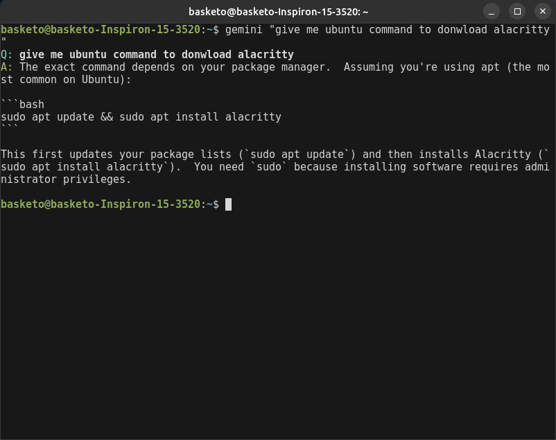
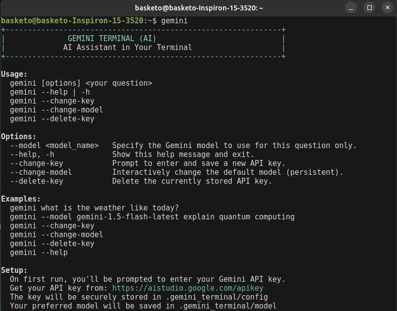
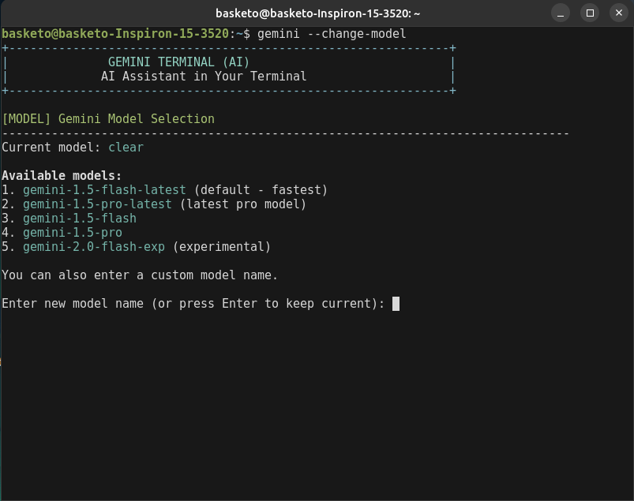
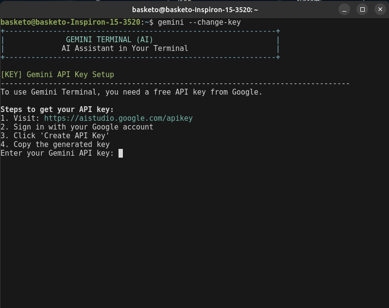

# GemCLI

A clean, fast terminal-based AI assistant powered by Google's Gemini API.



## Features

- **Clean Interface**: Simple Q&A format without bloated output
- **Persistent Model Selection**: Set your preferred model once, use everywhere
- **Secure Configuration**: API keys stored safely in your home directory
- **Multiple Models**: Support for all Gemini models including latest versions
- **Fast Responses**: Optimized for quick terminal interactions

## Screenshots

### Basic Usage


### Model Selection


### Configuration


## Installation

### Prerequisites
- GCC compiler
- curl (for API requests)
- Linux/macOS terminal

### Build & Install
```bash
git clone <repository-url>
cd gemcli
make
make install
```

**Note**: The install command places `gemini` in `~/.local/bin`. Make sure this directory is in your PATH:
```bash
echo 'export PATH="$HOME/.local/bin:$PATH"' >> ~/.bashrc
source ~/.bashrc
```

## Quick Start

1. **Get API Key**
   - Visit [Google AI Studio](https://aistudio.google.com/apikey)
   - Create a new API key
   - Copy the key

2. **First Run**
   ```bash
   gemini "Give me a command to install alacritty on Ubuntu?"
   ```
   You'll be prompted to enter your API key on first use.

3. **Ask Questions**
   ```bash
   gemini "What is quantum computing?"
   gemini "Explain machine learning in simple terms"
   ```

## Usage

### Basic Commands
```bash
# Ask a question
gemini "Your question here"

# Get help
gemini --help

# Change API key
gemini --change-key

# Change default model
gemini --change-model

# Delete stored API key
gemini --delete-key
```

### Model Options
```bash
# Use specific model for one question
gemini --model gemini-1.5-pro-latest "Complex question"

# Change default model (persistent)
gemini --change-model
```

## Available Models

- `gemini-1.5-flash-latest` (default - fastest)
- `gemini-1.5-pro-latest` (most capable)
- `gemini-1.5-flash`
- `gemini-1.5-pro`
- `gemini-2.0-flash-exp` (experimental)

## Configuration

Configuration files are stored in `~/.gemcli/`:
- `config` - Your API key
- `model` - Your preferred model

## Examples

```bash
# Simple question
gemini "What's the weather like?"
# Output:
# Q: What's the weather like?
# A: I don't have access to real-time weather data...

# Programming help
gemini "How do I reverse a string in Python?"

# Use different model temporarily
gemini --model gemini-1.5-pro-latest "Explain quantum entanglement"

# Change default model
gemini --change-model
# Interactive menu appears for model selection
```

## Building from Source

```bash
# Clean build
make clean && make

# Install to ~/.local/bin as 'gemini'
make install

# Uninstall
make uninstall

# Debug build
make DEBUG=1
```

## Troubleshooting

### API Key Issues
```bash
# Reset API key
gemini --change-key

# Delete and re-enter key
gemini --delete-key
gemini "test question"
```

### Model Issues
```bash
# Reset to default model
gemini --change-model
# Select option 1 (default)
```

### Build Issues
```bash
# Install dependencies (Ubuntu/Debian)
sudo apt update
sudo apt install build-essential curl

# Install dependencies (macOS)
xcode-select --install
brew install curl
```

### Command Not Found
If `gemini` command is not found after installation:
```bash
# Check if ~/.local/bin is in PATH
echo $PATH | grep -q "$HOME/.local/bin" && echo "PATH is OK" || echo "Add to PATH"

# Add to PATH (bash)
echo 'export PATH="$HOME/.local/bin:$PATH"' >> ~/.bashrc
source ~/.bashrc

# Add to PATH (zsh)
echo 'export PATH="$HOME/.local/bin:$PATH"' >> ~/.zshrc
source ~/.zshrc
```

## License

MIT License - see LICENSE file for details.

## Contributing

1. Fork the repository
2. Create a feature branch
3. Make your changes
4. Test thoroughly
5. Submit a pull request

## Support

- Check [Google AI Studio](https://aistudio.google.com/) for API issues
- Review [Gemini API documentation](https://ai.google.dev/gemini-api/docs) for model details
- Open an issue for bugs or feature requests# GemCLI
